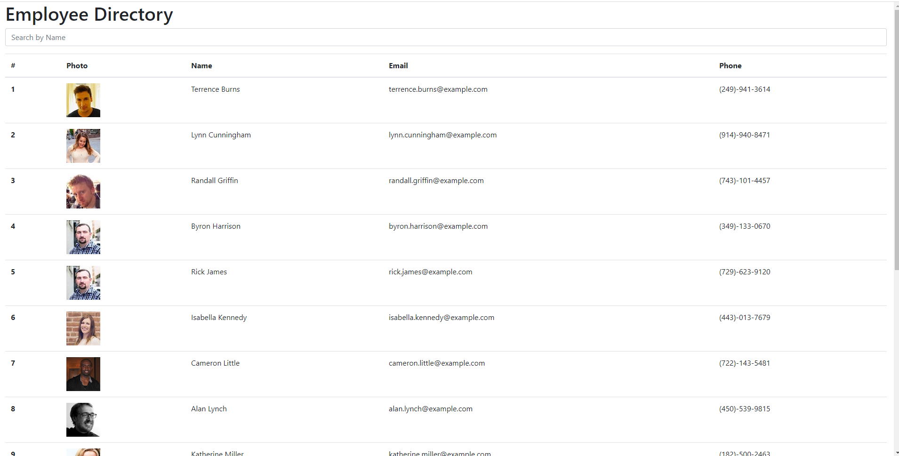

# Employee-Directory2

 
  
---

  ## Description:

  A directory that can be used to view current employees and their contact information. Employees can be searched by first or last name and sorted by last name as well.

---

 ## Table of Contents:
  *[Installation](#Installation) 
  *[Usage](#Usage)
  *[License](#License)
  *[Contributing](#Contribution)
  *[Tests](#Tests) 
  *[Questions](#Contact-Information)

  ---

   ## Installation:

  Clone repo from https://github.com/Arati15/Employee-Directory2 then npm install and npm start.

  ---

   ## Contributing:

  Clone repo from https://github.com/Arati15/Employee-Directory2 , make changes and then make a pull request.
